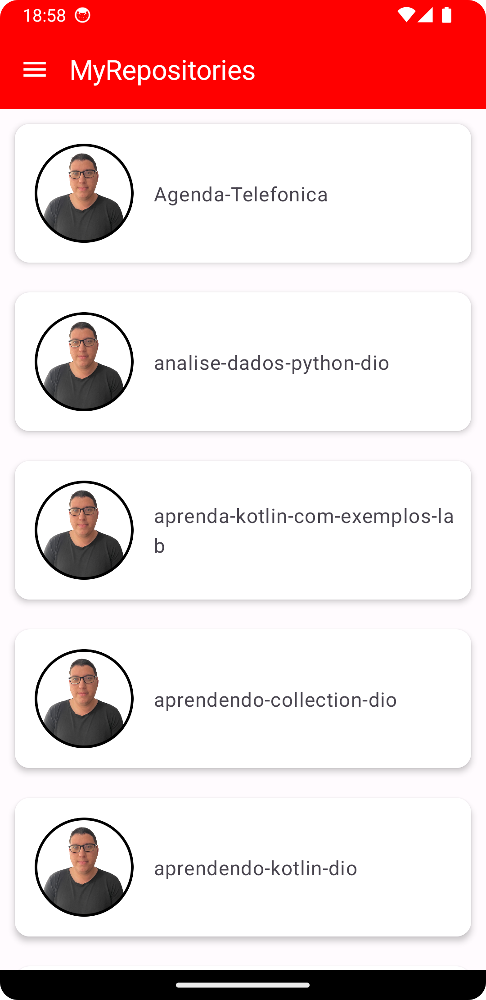
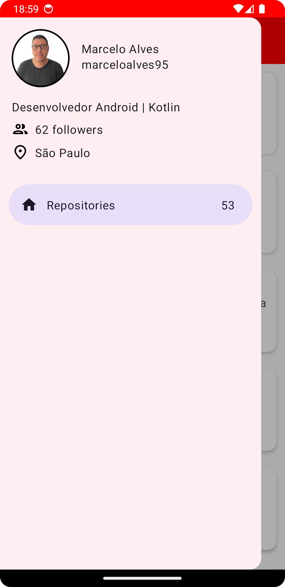

# MyRepositories
> Esse projeto tem como objetivo listar os meus projetos do Github

Nesse projeto a construção principal do projeto foi construído com:

- Padrão MVVM
- Gerenciamento de dependências usando o buildSrc e Kotlin DSL
- Injeção de Dependência
- Telas construídas com Android Jetpack (Compose)
- Testes Unitários
- Uso de libraries para determinados contextos

As principais libraries utilizadas no projeto:

- Android Jetpack
- Material 3
- Dagger Hilt
- Retrofit 
- Coil
- AssertK e Mockk 
- Jacoco

**Observação:**
Nesse projeto não consegui ajustar ainda o Jacoco com o Dagger Hilt. Com o uso do Koin não tenho esse problema.

Imagens do projeto:

|      |                       |
| --------------- | --------------------- |
| Tela Inicial | Tela de detalhes do usuário |
